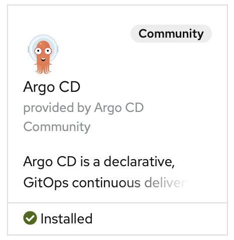

# Install Guide for ArgoCD (v0.0.8)

## Sourcing the Operator

ArgoCD's Operator can be installed either through the Openshift *OperatorHub*, or by manually applying the resource to the cluster. We outline both steps below.

### OperatorHub

Go to the OperatorHub and search for ArgoCD. You will see two versions come up, one for a Helm install and one without Helm. We will use the one **without** Helm, simply entitled "ArgoCD".

You will need to install the ArgoCD Operator to a particular namespace; one recommended strategy is to create a project/namespace entitled `argocd` and use this for all ArgoCD-related resources. Click "Install" and configure ArgoCD to whatever namespace you want to use.

The operator will spin-up in the selected project/namespace.

### Manually

Please refer to the [ArgoCD Operator documentation](https://argocd-operator.readthedocs.io/en/latest/install/openshift/) for details how to do a manual install of the operator. (I do **not** recommend this method for scenarios where it is possible to use the Openshift OperatorHub to install the Operator.)

## Instantiating ArgoCD

There exist and handful of pre-defined configurations for a handful of ArgoCD use-cases, such as High Availability. The YAML for these templates can be found in the [examples section](https://github.com/argoproj-labs/argocd-operator/tree/master/examples) of the [ArgoCD Operator repository](https://github.com/argoproj-labs/argocd-operator) on GitHub.

There are many options for configuring a particular ArgoCD instance. The documentation for all the possible configuration options for the `ArgoCD` custom-resource can be found in the [ArgoCD custom-resource reference](https://argocd-operator.readthedocs.io/en/latest/reference/argocd/).

### Configuring an ArgoCD Instance

The `argocd-custom.yaml` file defines an ArgoCD instance with the following features:

- A Route will be created automatically, exposing the ArgoCD Server for access to the GUI.
- A Grafana instance will be spun up and automatically linked to ArgoCD; it will have a route automatically created for accessing the dashboard.
  - Prometheus will be powering the Grafana.
  - *NOTE: I do not currently know how to log into the Grafana instance; it does not support the same Openshift OAuth login that the ArgoCD server supports.*
    - TODO: Determine how to log into Grafana and/or create user accounts with this access.
- Openshift OAuth login will be an option for logging into the ArgoCD Server instance.
  - Any Openshift user with access to the project should be able to log into ArgoCD, but will have only read-access unless defined otherwise, as seen below.
- User access is delegated according to user membership of Openshift Groups.
  - We define the default policy role within ArgoCD to be `role:readonly`. (`role:` here refers to an ArgoCD-specific policy, not Openshift `Roles`.
  - We configure ArgoCD so that the Openshift Group `argocd-admins` will have ArgoCD permissions defined by `role:admin`.
  
The documentation supporting all of the above configuration decisions is in the [ArgoCD custom-resource reference](https://argocd-operator.readthedocs.io/en/latest/reference/argocd/).

#### Note on User Access Configuration

More details on RBAC configuration can be found in ArgoCD's [RBAC guide](https://github.com/argoproj/argo-cd/blob/master/docs/operator-manual/rbac.md). We used the built-in `role:readonly` and `role:admin` policy groups and simply assigned Openshift Groups to each policy group.

If you use RBAC to configure your users, ensure that your Openshift users are members of the appropriate Openshift Groups (in this case, `argocd-admins`).

There is also a [User Management guide](https://github.com/argoproj/argo-cd/blob/master/docs/operator-manual/user-management/index.md) but it is not as clear how these rules can be configured with the newer operator-based CRs.

